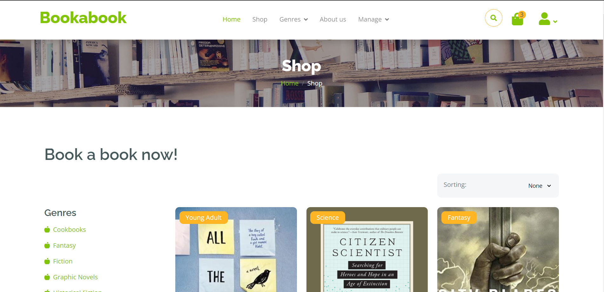
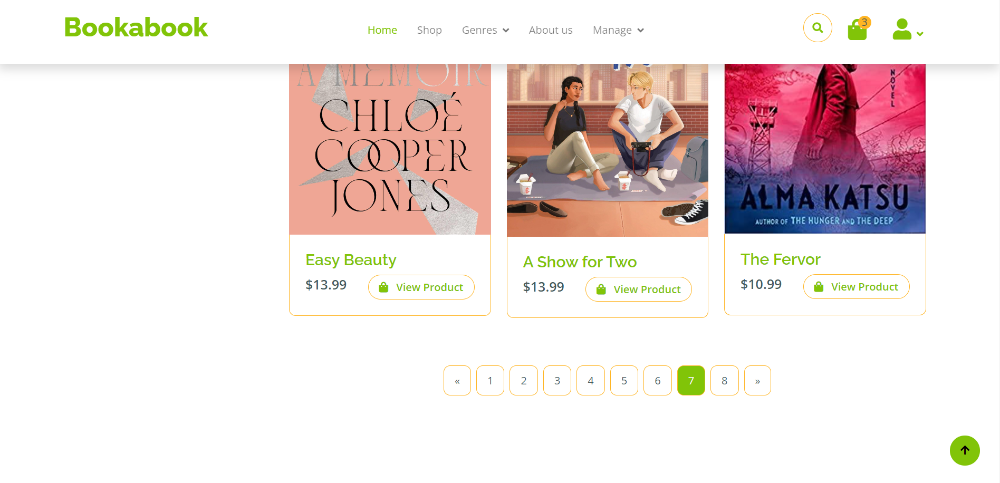
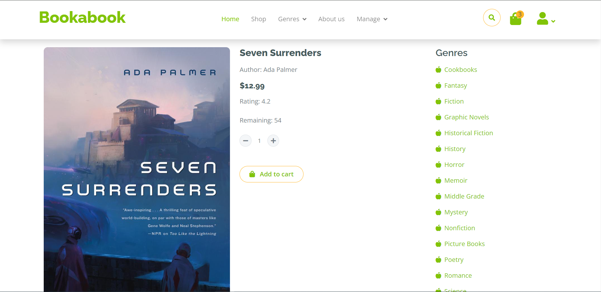
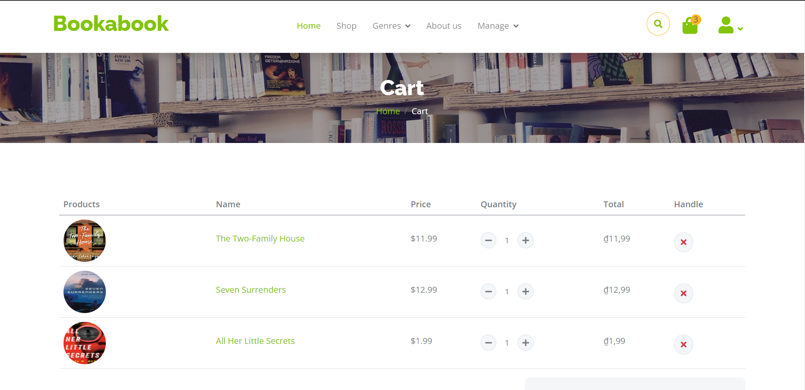
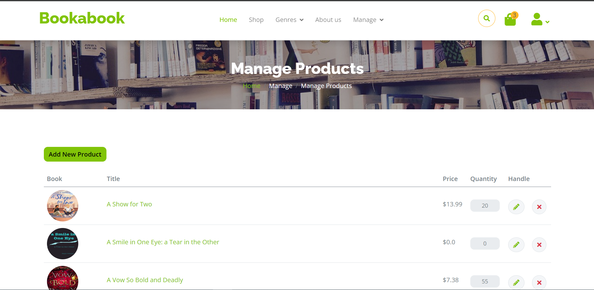

# Bookabook - Bookstore Web Application

This project is an Ant-based Java web application that simulates an online bookstore. Users can browse, view details, add to cart, and purchase books.

## Highlight

- **Online Bookstore Simulation**: Explore a variety of books, manage your cart, search for your books, and complete purchases.
- **Comprehensive CRUD Operations**: Efficiently manage users, orders, carts, and products.
- **Tech Stack**: Servlet, JSP, Bootstrap 5, HTML, CSS, JavaScript, and Microsoft SQL Server.

*Note: This is a private project and not intended for public use.*

## Features

### Browse Books




The product page features a selection of books, making it easy for users to discover titles.

#### View Book Details



Each book has a dedicated page with detailed information, including author, publisher, and description.

### Cart


The shopping cart displays all the items the user has added, along with their quantities and individual prices. Users can update quantities or remove items before proceeding to checkout. The cart also calculates and displays the total order price. 

### Admin Product Management



The admin interface provides tools for managing the book inventory. Administrators can add new books, update existing book details and remove books from the store.

*Note: The application includes additional features not shown here: browsing by category, searching, and managing other aspects of the online store (accounts, orders).*

## Installing Prerequisites

Make sure you have the following installed:

### Java Environment

- [Java Development Kit](https://www.oracle.com/java/technologies/downloads) (I used JDK 17)
- [Apache Tomcat](https://tomcat.apache.org/download-11.cgi) (I used Tomcat 11)
- [Apache Ant](https://ant.apache.org/bindownload.cgi) (I used Ant 1.10.14)

### Microsoft SQL Server

- [Microsoft SQL Server](https://www.microsoft.com/en-us/sql-server/sql-server-downloads) (I used SQL Server 2022 Developer)
- [SQL Server Management Studio (SSMS)](https://learn.microsoft.com/en-us/sql/ssms/download-sql-server-management-studio-ssms) (I used SSMS 20.1)

*Note: When setting up SSMS, set the username and password to `sa` and `123` to match the project's configuration.*

### Development Environment

- **IDE**: Visual Studio Code
- **Extension**: Community Server Connector (for connecting to Tomcat)

*Note: To add Tomcat, use the command palette (Ctrl+Shift+P) and type "Servers: Add Local Server."
Select "Tomcat" and choose the directory where Tomcat is installed (CATALINA_HOME).*

## Steps to Run

1. **Clone the repository**: Open the terminal and run
   ```bash
   git clone https://github.com/ntramanh1204/bookstore-web.git
   cd bookstore-web
   ```

2. **Run the SQL Script**: 
   Open `Bookabook.sql` in SSMS and execute it to set up the database schema and initial data.

3. **Start the Tomcat Server**: 
   In the "SERVERS" view on the left of VS Code, right-click on the Tomcat instance and select "Start."

4. **Build and Deploy the Project**: 
   Open the terminal in the project directory and run
   ```bash
   ant run
   ```

5. **Access the Application**: 
   Open your web browser and navigate to `http://localhost:8080` (or your pre-configured port) to use the application.

## Small Note

I created my books' information by using Selenium to crawl book data from Goodreads' best books over the years and put these data into my database. The relevant commands to create and populate the database are included in the `Bookabook.sql`. The images of the books I put in `web/images/books`. You can find the Jupyter notebook used for this task in the file `crawl-best-books-final.ipynb`.


## License

This project is currently a private project and is not licensed for public use. All rights are reserved by the project owner.

## References

- [Themewagon's Fruitable template](https://themewagon.com/themes/fruitables-free/): Bootstrap 5 template used in this project.
- [How to write a README](https://github.com/banesullivan/README): Helpful instructions on crafting a good README.